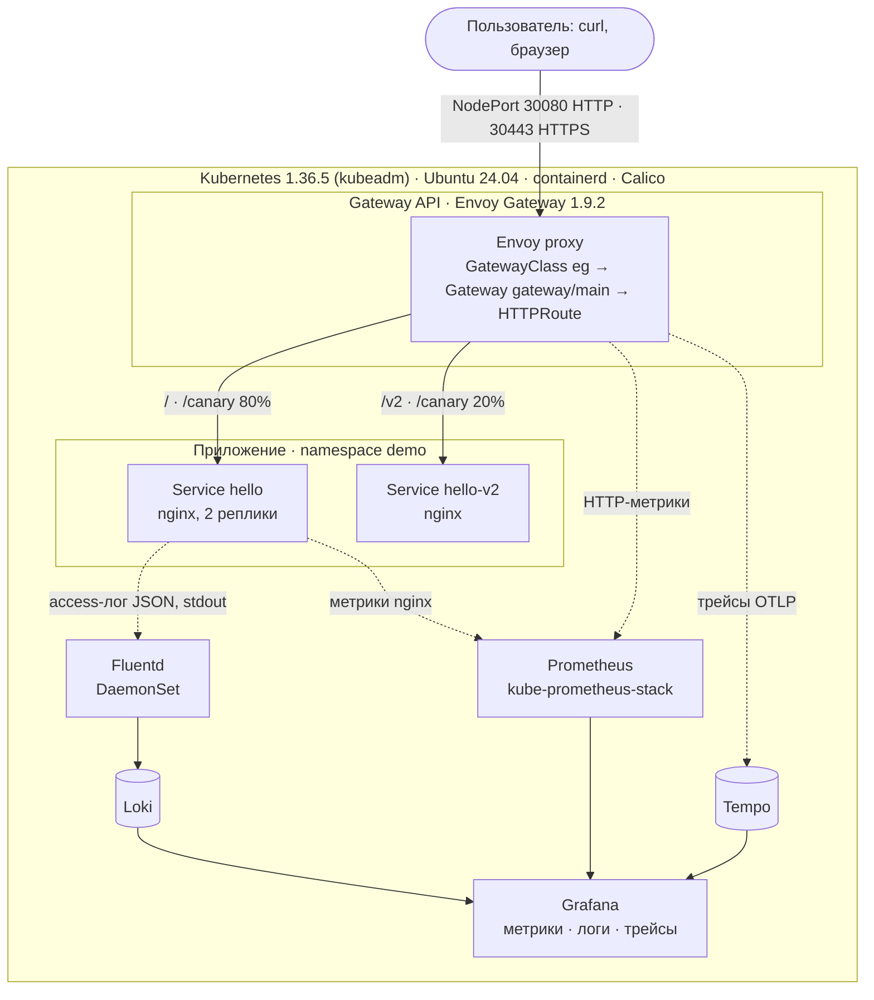
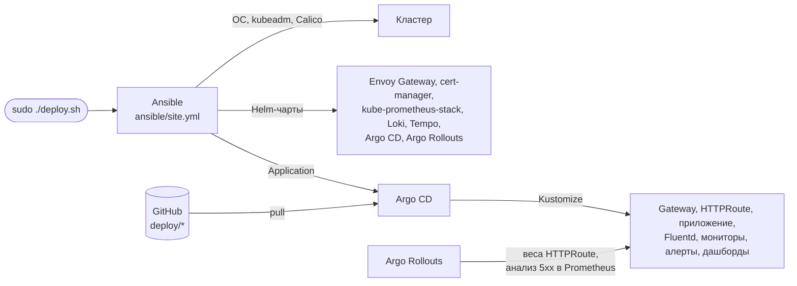

# Kubernetes, Gateway API, мониторинг и логирование

[](https://github.com/glev23/devops_case/actions/workflows/ci.yml)

Решение кейса онлайн-этапа DevOps-хакатона. Одна команда `sudo ./deploy.sh`
на чистой Ubuntu 24.04 создаёт кластер Kubernetes (kubeadm), разворачивает
веб-приложение с доступом через Gateway API, сбор метрик в Prometheus и сбор
логов приложения через Fluentd. Повторный запуск ничего не меняет
(`changed=0`). Работоспособность проверяется одной командой `make verify`.

Каждый коммит в `main` проходит в GitHub Actions полную установку с нуля на
`ubuntu-24.04`, повторный запуск с контролем идемпотентности, все проверки и
демонстрационный сценарий (бейдж выше).

## Содержание

1. [Краткое описание](#1-краткое-описание)
2. [Архитектура](#2-архитектура)
3. [Технологии и версии](#3-технологии-и-версии)
4. [Требования к среде](#4-требования-к-среде)
5. [Развёртывание](#5-развёртывание)
6. [Проверка работоспособности](#6-проверка-работоспособности)
7. [Доступ через браузер](#7-доступ-через-браузер)
8. [Дополнительные возможности](#8-дополнительные-возможности)
9. [Безопасность](#9-безопасность)
10. [Структура репозитория](#10-структура-репозитория)
11. [Известные ограничения](#11-известные-ограничения)
12. [Документация проекта](#12-документация-проекта)

## 1. Краткое описание

| Обязательная часть кейса | Реализация |
|---|---|
| Kubernetes-окружение | kubeadm **1.36.5**, один узел (control plane + рабочая нагрузка), containerd, Calico |
| Веб-приложение | nginx (официальный образ `nginxinc/nginx-unprivileged`), ответ `Hello World! from <имя пода>`, access-лог в JSON в stdout |
| Gateway API | **Envoy Gateway 1.9.2**: `GatewayClass` → `Gateway` → `HTTPRoute` → `Service`; вход через NodePort 30080 (HTTP) и 30443 (HTTPS) |
| Мониторинг | Prometheus из Helm-чарта kube-prometheus-stack: метрики узла, control plane, Kubernetes-объектов, Envoy и nginx |
| Логирование | **Fluentd** (DaemonSet) собирает логи всех контейнеров и отправляет их в Loki; просмотр — Grafana и LogQL |
| Ubuntu 24.04 | Проверено на Ubuntu 24.04.5 LTS (VM 4 vCPU / 8 ГБ) и на каждом коммите — на раннере GitHub `ubuntu-24.04` |
| Автоматизация | `sudo ./deploy.sh` → Ansible + Helm + Kustomize + Argo CD; идемпотентно; `make verify` — около 50 автоматических проверок |

Дополнительно реализованы расширенная маршрутизация Gateway API (path,
hostname, веса, TLS, политики трафика), HTTP-метрики, алерты, дашборды,
SLO, трейсинг, GitOps, canary-релизы с автоматическим откатом и CI/CD —
см. [раздел 8](#8-дополнительные-возможности).

## 2. Архитектура



**Путь запроса.** Клиент обращается к NodePort узла (30080 или 30443).
NodePort ведёт на прокси Envoy, которым управляет контроллер Envoy Gateway
по ресурсам Gateway API. `HTTPRoute demo/hello` направляет запрос в
`Service hello` (по пути `/v2` — в `hello-v2`, по `/canary` — в оба с весами
80/20). Запросы с заголовком `Host: grafana.devops.test`,
`prometheus.devops.test`, `argocd.devops.test` уходят в соответствующие UI.

**Мониторинг.** Prometheus собирает метрики узла (node-exporter), kubelet и
cAdvisor (CPU/RAM контейнеров), control plane (apiserver, etcd, scheduler,
controller-manager, kube-proxy, CoreDNS), kube-state-metrics, прокси Envoy
(HTTP-метрики по маршрутам), nginx (через sidecar `nginx-prometheus-exporter`)
и компонентов самого решения.

**Логирование.** nginx пишет access-лог в JSON в stdout, error-лог — в
stderr. Fluentd на узле читает `/var/log/containers/*.log`, добавляет метки
`namespace`, `pod`, `container`, `stream`, разбирает JSON и отправляет записи
в Loki. Логи и метрики просматриваются в одной Grafana.

**Развёртывание и доставка.** `deploy.sh` устанавливает Ansible из
репозитория Ubuntu и запускает `ansible/site.yml`. Ansible готовит узел,
создаёт кластер и ставит Helm-чарты платформы. Собственные манифесты из
каталога `deploy/` доставляет Argo CD: кластер сам забирает их из Git. Argo
Rollouts выполняет canary-релизы приложения, управляя весами `HTTPRoute`.



| Play | Роли | Что делает |
|---|---|---|
| Kubernetes node and cluster | `node`, `kubeadm`, `cni`, `helm` | Подготовка ОС (swap, модули ядра, sysctl, containerd), `kubeadm init`, Calico, Helm |
| Platform | `certmanager`, `gateway`, `monitoring`, `logging`, `tracing`, `rollouts`, `gitops` | Helm-чарты сторонних компонентов с закреплёнными версиями, генерация паролей в Secret |
| Workloads | `workloads` | Манифесты из `deploy/` (Kustomize): Argo CD `Application` на каждый каталог с ожиданием `Synced`/`Healthy`, затем ожидание готовности Gateway, сертификата, Fluentd и приложения |

## 3. Технологии и версии

Все версии закреплены в [`ansible/group_vars/all.yml`](ansible/group_vars/all.yml)
и в манифестах; теги `latest` не используются. Совместимость сверена с
официальными матрицами (Kubernetes 1.36 входит в поддерживаемые диапазоны
Calico 3.32 и Envoy Gateway 1.9).

| Компонент | Версия | Способ установки |
|---|---|---|
| ОС | Ubuntu 24.04 LTS | — |
| Kubernetes (kubeadm, kubelet, kubectl) | **1.36.5** | apt, `pkgs.k8s.io`, `apt-mark hold` |
| containerd | 2.2.1 | apt, репозиторий Ubuntu |
| Calico (CNI) | 3.32.2 | Tigera Operator (официальный манифест Calico) |
| Helm | 3.22.0 | бинарный файл с проверкой SHA-256 |
| Ansible | ansible-core 2.16 (kubernetes.core 2.4.0) | apt, репозиторий Ubuntu (ставит `deploy.sh`) |
| Envoy Gateway (реализация Gateway API) | **1.9.2**; Envoy Proxy 1.39.1; CRD Gateway API 1.6.1 | Helm-чарт `gateway-helm` |
| cert-manager | 1.21.2 | Helm-чарт |
| nginx (приложение) | 1.30.5 (`nginxinc/nginx-unprivileged:1.30.5-alpine`) | Kustomize, `deploy/app` |
| nginx-prometheus-exporter | 1.5.3 | sidecar приложения |
| kube-prometheus-stack | чарт 91.8.2: Prometheus 3.15.0, Prometheus Operator 0.94.1, Alertmanager 0.34.1, Grafana 13.2.3, node-exporter 1.12.1, kube-state-metrics 2.20.0 | Helm-чарт |
| Fluentd | 1.19 (образ `grafana/fluent-plugin-loki:3.7.8`) | Kustomize, `deploy/logging` |
| Loki | 3.6.11 (чарт `grafana/loki` 7.3.0, single binary) | Helm-чарт |
| Tempo | 3.1.0 (чарт `grafana-community/tempo` 3.1.0) | Helm-чарт |
| Argo CD | 3.5.3 (чарт 10.9.6) | Helm-чарт |
| Argo Rollouts | 1.10.0 (чарт 2.43.2), плагин Gateway API 0.17.0 | Helm-чарт; плагин — образ по digest |

**Ресурсы Gateway API** (Envoy Gateway, `gateway.networking.k8s.io/v1`):

| Ресурс | Имя | Назначение |
|---|---|---|
| `GatewayClass` | `eg` | Класс контроллера Envoy Gateway, параметры — `EnvoyProxy` (NodePort 30080/30443, трейсинг) |
| `Gateway` | `gateway/main` | Listener `http` :80 и `https` :443 (TLS, сертификат `*.devops.test`); маршруты принимаются только из namespace с меткой `gateway-access: "true"` |
| `HTTPRoute` | `demo/hello` | Приложение: `/`, `/v2`, `/canary`, `/error`, `/limited`; без `hostnames` — любой Host |
| `HTTPRoute` | `monitoring/grafana`, `monitoring/prometheus`, `argocd/argocd` | UI по hostname `*.devops.test` |
| Расширения Envoy Gateway | `EnvoyProxy`, `ClientTrafficPolicy`, `BackendTrafficPolicy`, `SecurityPolicy` | Параметры прокси, политики трафика, basic auth для Prometheus |

## 4. Требования к среде

| Параметр | Требование |
|---|---|
| ОС | Чистая Ubuntu 24.04 LTS (server), архитектура x86_64 (amd64) |
| Ресурсы | 4 vCPU, 8 ГБ RAM, диск от 30 ГБ. Фактически занято после установки: ~4,6 ГБ RAM, ~12 ГБ диска вместе с ОС |
| Права | Пользователь с `sudo` |
| Сеть | Доступ в интернет к `pkgs.k8s.io`, `registry.k8s.io`, `docker.io`, `quay.io`, `ghcr.io`, `ecr-public.aws.com`, `github.com`, `get.helm.sh`, чартам Helm и к этому репозиторию на GitHub |
| Порты узла | Свободны 30080 и 30443 (NodePort Gateway), а также порты Kubernetes (6443, 10250 и др.) |
| Прочее | На узле не установлены Docker и другой Kubernetes: их containerd конфликтует с пакетом `containerd` из Ubuntu. Swap отключается автоматически |

Всё остальное (containerd, kubeadm, Helm, Ansible, `make`) устанавливает
`deploy.sh`. Кластер отдельно создавать не нужно.

## 5. Развёртывание

### Быстрый старт

```bash
git clone https://github.com/glev23/devops_case.git
cd devops_case
sudo ./deploy.sh
make verify
```

### Пошагово

**Шаг 1. Получить репозиторий** на узел Ubuntu 24.04:

```bash
git clone https://github.com/glev23/devops_case.git
cd devops_case
```

**Шаг 2. Развернуть решение:**

```bash
sudo ./deploy.sh
```

Скрипт устанавливает Ansible из репозитория Ubuntu и выполняет
`ansible/site.yml`: подготовка узла, `kubeadm init`, Calico, все компоненты
платформы, Gateway, приложение, мониторинг и логирование. Ожидание
готовности каждого компонента встроено в playbook. Успешное завершение —
строка `PLAY RECAP` с `failed=0`.

Длительность первой установки — от 7 до 15 минут в зависимости от канала
(на раннере GitHub — 6 мин 42 с). Основное время занимает загрузка пакетов и
образов.

`kubeconfig` копируется пользователю, который вызвал `sudo`
(`~/.kube/config`), поэтому дальнейшие команды `kubectl` и `make`
выполняются без `sudo`.

**Шаг 3. Проверить идемпотентность** (необязательно):

```bash
sudo ./deploy.sh
```

Ожидаемый результат — `changed=0` в `PLAY RECAP`. Ничего не пересоздаётся,
пароли и сертификаты не меняются. В CI повторный запуск обязателен: job
падает, если `changed` не равен 0.

**Шаг 4. Проверить работоспособность:**

```bash
make verify
```

Ожидаемый результат — `Все проверки пройдены`, код выхода 0. Подробнее — в
[разделе 6](#6-проверка-работоспособности).

### Команды

| Команда | Назначение |
|---|---|
| `sudo ./deploy.sh` (после первой установки — `sudo make deploy`) | Развернуть или привести к описанному состоянию |
| `make verify` | Автоматическая проверка всех компонентов |
| `make demo` | Пошаговая демонстрация решения с паузами; `make demo DEMO_ARGS="--auto"` — без пауз |
| `make release-good`, `make release-bad`, `make release-reset`, `make release-status` | Демонстрационные canary-релизы (см. [раздел 8](#8-дополнительные-возможности)) |
| `sudo ./destroy.sh` | Удалить кластер и данные решения (`kubeadm reset`) для переустановки с нуля; пакеты и образы остаются |
| `make help` | Список целей Makefile |

Пакет `make` на чистой Ubuntu отсутствует и устанавливается при первом
запуске `deploy.sh`, поэтому первый запуск — через `./deploy.sh`.

### Параметры

Аргументы `deploy.sh` передаются в `ansible-playbook`, параметры
переопределяются через `-e`:

| Параметр | По умолчанию | Назначение |
|---|---|---|
| `gitops_enabled` | `true` | Манифесты `deploy/*` доставляет Argo CD из GitHub. `false` — применяются из локальной копии через `kubectl diff`/`apply` (без доступа к GitHub и без Argo CD) |
| `gitops_repo_url`, `gitops_revision` | этот репозиторий, `main` | Источник для Argo CD (например, для форка) |
| `node_stable_ip` | `10.200.0.10` | Стабильный адрес узла на dummy-интерфейсе: кластер переживает смену IP по DHCP. Пустая строка — использовать основной IPv4 |
| `pod_cidr` | `10.244.0.0/16` | Сеть подов Calico |

Пример установки без GitOps:

```bash
sudo ./deploy.sh -e gitops_enabled=false
```

### Установка на удалённый узел

По умолчанию playbook выполняется на том узле, где запущен `deploy.sh`.
Для установки с управляющей машины по SSH укажите узел в
[`ansible/inventory.ini`](ansible/inventory.ini) (например,
`node1 ansible_host=192.0.2.10 ansible_user=ubuntu`) и выполните
`ansible-playbook site.yml` из каталога `ansible/`. Нужны Ansible с
коллекциями `kubernetes.core`, `community.general`, `ansible.posix` и
`sudo` без пароля на узле. Файлы решения копируются на узел в
`/opt/devops-case`, проверка — там же: `cd /opt/devops-case && make verify`.

### Переустановка с нуля

```bash
sudo ./destroy.sh
sudo ./deploy.sh
```

`destroy.sh` запрашивает подтверждение (`--yes` — без вопроса), выполняет
`kubeadm reset` и удаляет состояние CNI, правила iptables и данные решения.
На узле с работающими подами `kubeadm reset` может занять до 2 минут.

## 6. Проверка работоспособности

### Автоматическая проверка

```bash
make verify
```

[`scripts/verify.sh`](scripts/verify.sh) выполняет около 50 проверок и
печатает результат каждой. Основные группы:

| Группа | Что проверяется |
|---|---|
| Кластер | Узел `Ready`, все поды `Running` |
| Приложение | Ответ `Hello World!` изнутри кластера; запрос с уникальной меткой есть в access-логе nginx |
| Gateway API | `GatewayClass` `Accepted`, `Gateway` `Programmed`, `HTTPRoute` `Accepted`/`ResolvedRefs`; `curl` на NodePort → `Hello World!`; запрос дошёл до nginx через Envoy |
| Маршрутизация | `/v2`, `/canary` (80/20 на 100 запросах), `/error` → 500, HTTPS с проверкой сертификата, маршруты по hostname, rate limit → 429 |
| Prometheus | API отвечает, нет targets в состоянии DOWN, присутствуют обязательные job, `sum(nginx_http_requests_total) > 0`, HTTP-метрики Envoy по маршрутам, правила алертов загружены |
| Логирование | Fluentd готов; запрос с уникальной меткой, отправленный через Gateway, найден в Loki запросом LogQL |
| Трейсинг | Трейс с известным ID найден в Tempo, строка лога с тем же ID — в Loki |
| Grafana | Доступна через Gateway, datasources Prometheus, Loki, Tempo — `OK`, дашборды загружены |
| Прочее | Argo CD Applications `Synced`/`Healthy`, Rollout `Healthy`, NetworkPolicy блокирует доступ из чужого namespace, PDB, SLO |

### Демонстрационный сценарий

```bash
make demo
```

[`scripts/demo.sh`](scripts/demo.sh) — 9 шагов с паузами: кластер и
компоненты, Gateway API, PromQL, SLO и алерты, один запрос — его лог в Loki
и трейс в Tempo, Argo CD, хороший и плохой canary-релиз, ссылки и пароли.
Каждый шаг печатает выполняемую команду. После сценария состояние кластера
возвращается к исходному.

### Ручная проверка

Команды выполняются на узле. Адрес узла:

```bash
IP=$(hostname -I | awk '{print $1}')
```

#### Приложение через Gateway API

```bash
curl http://$IP:30080/
```

Ожидаемый ответ — `Hello World! from hello-<хэш>-<суффикс>` (имя пода).
Повторные запросы показывают имена обоих подов.

```bash
curl -i http://$IP:30080/
```

Ответ `HTTP/1.1 200 OK` с заголовком `x-backend: v1`, который добавлен
фильтром `HTTPRoute`, — признак того, что запрос прошёл через Gateway API.

Состояние ресурсов Gateway API:

```bash
kubectl get gatewayclass,gateway -A
kubectl get httproute -A
```

`GatewayClass eg` — `ACCEPTED True`, `Gateway main` — `PROGRAMMED True`,
маршруты `demo/hello`, `monitoring/grafana`, `monitoring/prometheus`,
`argocd/argocd`.

Дополнительные маршруты:

```bash
curl http://$IP:30080/v2                                         # hello-v2
for i in $(seq 20); do curl -s http://$IP:30080/canary; done     # ~80% hello, ~20% hello-v2
curl -s -o /dev/null -w '%{http_code}\n' http://$IP:30080/error  # 500
```

HTTPS с проверкой сертификата по CA кластера (без `-k`):

```bash
kubectl -n gateway get secret devops-test-tls -o jsonpath='{.data.ca\.crt}' | base64 -d > ca.crt
curl --cacert ca.crt --resolve hello.devops.test:30443:$IP https://hello.devops.test:30443/
```

#### Мониторинг (Prometheus)

**Какие метрики собираются:**

| Источник | Примеры метрик | Что показывают |
|---|---|---|
| nginx (`nginx-prometheus-exporter`, job `hello`) | `nginx_http_requests_total`, `nginx_connections_active` | Запросы и соединения приложения |
| Envoy proxy (PodMonitor `envoy-proxy`) | `envoy_cluster_upstream_rq_total`, `envoy_cluster_upstream_rq_xx`, `envoy_http_downstream_rq_time_bucket` | Запросы, коды ответов и время ответа по маршрутам `HTTPRoute` |
| node-exporter | `node_cpu_seconds_total`, `node_memory_MemAvailable_bytes` | CPU, память, диск, сеть узла |
| kubelet / cAdvisor | `container_cpu_usage_seconds_total`, `container_memory_working_set_bytes` | CPU и RAM контейнеров |
| kube-state-metrics | `kube_deployment_status_replicas_available`, `kube_pod_status_phase` | Состояние объектов Kubernetes |
| Control plane | `apiserver_request_total`, `etcd_server_has_leader` и др. | apiserver, etcd, scheduler, controller-manager, kube-proxy, CoreDNS |
| Компоненты решения | Envoy Gateway, Loki, Tempo, Argo CD, Argo Rollouts, Grafana, Prometheus, Alertmanager | Работа платформы |
| Recording rules | `route:envoy_upstream_rq:rate5m`, `slo:sli:availability_3d` | Запросы в секунду по маршрутам, SLO |

Prometheus доступен через Gateway по hostname `prometheus.devops.test` и
закрыт basic auth (пользователь `admin`, пароль генерируется при установке).
Функция-помощник для запросов PromQL:

```bash
PROM_PW=$(kubectl -n monitoring get secret prometheus-basic-auth -o jsonpath='{.data.password}' | base64 -d)
promql() {
  curl -s -G -u "admin:$PROM_PW" -H 'Host: prometheus.devops.test' \
    "http://$IP:30080/api/v1/query" --data-urlencode "query=$1" |
  python3 -c 'import json,sys; [print(r["metric"], r["value"][1]) for r in json.load(sys.stdin)["data"]["result"]]'
}
```

| Запрос | Ожидаемый результат |
|---|---|
| `promql 'up{job="hello"}'` | Две строки (по поду приложения) со значением `1` — target приложения `UP` |
| `promql 'count(up == 0) or vector(0)'` | `{} 0` — нет недоступных targets |
| `promql 'count by (job) (up == 1)'` | Список job: `apiserver`, `kubelet`, `node-exporter`, `kube-state-metrics`, `kube-etcd`, `hello`, `monitoring/envoy-proxy` и др. |
| `promql 'sum(rate(nginx_http_requests_total[5m]))'` | Положительное число — запросов в секунду к nginx (фоновая нагрузка `loadgen` ~4–6 в секунду) |
| `promql 'route:envoy_upstream_rq:rate5m'` | Запросы в секунду по правилам `demo/hello#0…#4` |
| `promql 'sum by (envoy_response_code_class) (rate(envoy_cluster_upstream_rq_xx{envoy_cluster_name=~"httproute/demo/.*"}[5m]))'` | Классы кодов ответа `2`, `4`, `5` (4xx и 5xx создаёт `loadgen` намеренно) |
| `promql 'sum by (pod) (container_memory_working_set_bytes{namespace="demo",container!=""})'` | Память подов приложения, байты |

Те же запросы можно выполнить в UI Prometheus
(`http://prometheus.devops.test:30080`, раздел Status → Targets) или в
Grafana Explore — см. [раздел 7](#7-доступ-через-браузер).

#### Логирование (Fluentd → Loki)

**Какие логи собираются и куда поступают.** Fluentd (DaemonSet
`logging/fluentd`) читает логи всех контейнеров кластера из
`/var/log/containers/*.log`. Для приложения это access-лог nginx в JSON
(stdout; поля `time`, `method`, `uri`, `status`, `request_time`,
`x_forwarded_for`, `request_id`, `traceparent` и др.) и error-лог (stderr).
Записи получают метки `namespace`, `pod`, `container`, `stream`, JSON
разбирается в поля и отправляется в Loki (`http://loki.logging:3100`,
хранение 72 часа). Буфер Fluentd — на диске узла (`/var/log/fluentd`).
Конфигурация — [`deploy/logging/fluent.conf`](deploy/logging/fluent.conf).

**Проверка.** Отправить запрос с уникальной меткой через Gateway:

```bash
curl "http://$IP:30080/?trace=check-123"
```

Через 5–10 секунд найти его в Loki (запрос идёт через прокси API-сервера
Kubernetes, пароль не нужен):

```bash
logql() {
  kubectl get --raw "/api/v1/namespaces/logging/services/loki:3100/proxy/loki/api/v1/query_range?since=15m&query=$(python3 -c 'import sys,urllib.parse; print(urllib.parse.quote(sys.argv[1]))' "$1")" |
  python3 -c 'import json,sys; [print(s["stream"].get("pod"), v[1]) for s in json.load(sys.stdin)["data"]["result"] for v in s["values"]]'
}
logql '{namespace="demo",container="nginx"} |= "check-123" | json | status="200"'
```

Ожидаемый результат — имя пода и JSON-строка access-лога этого запроса:
`"uri":"/?trace=check-123"`, `"status":200`, `"x_forwarded_for":"<IP клиента>"`.

В Grafana: Explore → datasource Loki → тот же запрос LogQL. У строки лога
есть ссылка на трейс запроса в Tempo.

## 7. Доступ через браузер

UI публикуются через тот же Gateway по hostname. Для браузера добавьте
запись в `hosts` машины, с которой открываете UI (`/etc/hosts` или
`C:\Windows\System32\drivers\etc\hosts`), подставив IP узла:

```
<IP узла>  grafana.devops.test prometheus.devops.test argocd.devops.test hello.devops.test
```

| UI | Адрес | Пользователь | Пароль |
|---|---|---|---|
| Приложение | `http://<IP узла>:30080/`, `https://hello.devops.test:30443/` | — | — |
| Grafana | `http://grafana.devops.test:30080` | `admin` | `kubectl -n monitoring get secret grafana-admin -o jsonpath='{.data.admin-password}' \| base64 -d` |
| Prometheus | `http://prometheus.devops.test:30080` | `admin` | `kubectl -n monitoring get secret prometheus-basic-auth -o jsonpath='{.data.password}' \| base64 -d` |
| Argo CD | `http://argocd.devops.test:30080` | `admin` | `kubectl -n argocd get secret argocd-initial-admin-secret -o jsonpath='{.data.password}' \| base64 -d` |

Пароли генерируются при первой установке и хранятся только в Secret
кластера; повторный запуск `deploy.sh` их не меняет.

Дашборды Grafana решения:

- «DevOps case / Gateway и приложение» —
  `http://grafana.devops.test:30080/d/devops-case-gateway`: запросы, коды
  ответа, p95 по маршрутам, доля трафика по версиям, логи приложения;
- «DevOps case / SLO доступности» — `http://grafana.devops.test:30080/d/devops-case-slo`.

Кроме них, kube-prometheus-stack устанавливает стандартные дашборды
кластера, узла, подов и компонентов control plane.

В Firefox с включённым DNS-over-HTTPS записи `hosts` не применяются: нужно
добавить `devops.test` в исключения DoH или отключить DoH.

## 8. Дополнительные возможности

Каждая возможность разворачивается той же командой `sudo ./deploy.sh` и
проверяется в `make verify` и в CI.

### Gateway API

| Возможность | Реализация | Проверка |
|---|---|---|
| Несколько маршрутов, маршрутизация по path | Правила `/`, `/v2`, `/canary`, `/error`, `/limited` в `HTTPRoute demo/hello` | `curl http://$IP:30080/v2` |
| URL rewrite, изменение заголовков | `URLRewrite` (`/v2` → `/`), `ResponseHeaderModifier` (`X-Backend`, `X-Route`) | `curl -i http://$IP:30080/v2` → `x-backend: v2` |
| Несколько backend, traffic splitting | `/canary` → `hello` 80% / `hello-v2` 20% | цикл из 20 запросов к `/canary` |
| Маршрутизация по hostname | `grafana.devops.test`, `prometheus.devops.test`, `argocd.devops.test`; остальные Host → приложение | `curl -H 'Host: grafana.devops.test' http://$IP:30080/api/health` |
| TLS | Listener `https` :443 → NodePort 30443; сертификат `*.devops.test` выпускает cert-manager из собственной цепочки CA (`selfsigned` → `devops-ca` → `devops-test-tls`); ключи в репозиторий не попадают | `curl --cacert ca.crt …` (раздел 6) |
| Политики трафика | `BackendTrafficPolicy`: таймауты (запрос 5 с, подключение 2 с), ретраи только на сетевые сбои, circuit breaker, rate limit 5 запросов/с на `/limited`. `ClientTrafficPolicy`: таймауты клиента, лимит соединений, отклонение заголовков с `_`, сохранение `X-Request-Id` | `for i in $(seq 15); do curl -s -o /dev/null -w '%{http_code}\n' http://$IP:30080/limited; done` → часть ответов `429` |
| Аутентификация на Gateway | `SecurityPolicy` с basic auth для Prometheus | без пароля — `401`, с паролем — `200` |

### Мониторинг, логирование, трейсинг

| Возможность | Реализация | Проверка |
|---|---|---|
| HTTP-метрики | Количество запросов, коды ответа, latency по каждому правилу `HTTPRoute` (метрики Envoy); метрики nginx с разбивкой по версиям | PromQL из раздела 6 |
| CPU/RAM | node-exporter, cAdvisor, kube-state-metrics | `promql 'sum by (pod) (container_memory_working_set_bytes{namespace="demo",container!=""})'` |
| Алерты | `PrometheusRule devops-case`: `DemoAppTargetDown`, `DemoAppNoReplicas`, `GatewayHigh5xxRatio`, `GatewayHighLatencyP95`, `GatewayProxyDown`, `FluentdNotReady`, `LokiDown`, `SLOErrorBudgetFastBurn`, `SLOErrorBudgetSlowBurn` | UI Prometheus → Alerts |
| Дашборды | Два собственных дашборда (JSON в `deploy/monitoring/dashboards/`) плюс стандартные дашборды чарта | Grafana, раздел 7 |
| SLO | SLI — доля ответов не-5xx по маршрутам приложения, цель 99,9%, бюджет ошибок, burn-rate алерты 14,4× (1 ч + 5 мин) и 6× (6 ч + 30 мин) | `promql 'slo:sli:availability_3d'`, дашборд «SLO доступности» |
| Фоновая нагрузка | `demo/loadgen` — ~4 запроса/с через Gateway (включая HTTPS, 404 и 500), графики заполнены сразу после установки | дашборд «Gateway и приложение» |
| Централизованные логи | Логи всех контейнеров кластера в Loki, поиск по меткам и полям JSON | Grafana Explore → Loki |
| Распределённый трейсинг | Envoy отправляет спаны в Tempo по OTLP; заголовок `traceparent` попадает в лог nginx; в Grafana — переход лог → трейс и трейс → логи | `make verify`, раздел «Трейсинг»; `make demo`, шаг 5 |

### Доставка и надёжность

| Возможность | Реализация | Проверка |
|---|---|---|
| GitOps | Argo CD синхронизирует `deploy/gateway`, `deploy/monitoring`, `deploy/logging`, `deploy/app` с веткой `main` (pull-модель, без входящих подключений к кластеру); изменение в Git попадает в кластер примерно за 1,5 минуты без запуска `deploy.sh` | `kubectl -n argocd get applications` — все `Synced`/`Healthy`; UI Argo CD |
| Canary-релизы с автоматическим откатом | Argo Rollouts с плагином Gateway API: 10% → 30% → 60% → 100% через веса правила `/` в `HTTPRoute`, фоновый анализ доли 5xx в Prometheus (порог 2%) | `make release-bad` — версия, отвечающая 500, автоматически откатывается примерно за 40 с; `make release-good` — новая версия доходит до 100% примерно за 2,5 минуты; `make release-reset` — возврат к версии из Git |
| CI/CD | GitHub Actions ([`.github/workflows/ci.yml`](.github/workflows/ci.yml)): `lint` — yamllint, ansible-lint (профиль production), shellcheck, `kustomize build` + kubeconform; `secrets` — gitleaks по всей истории; `e2e` — установка с нуля на `ubuntu-24.04`, повторный запуск с контролем `changed=0`, `verify.sh`, `make demo`, плохой и хороший релиз | бейдж CI, вкладка Actions репозитория |
| Идемпотентность | Ansible-модули, `helm upgrade --install`, `kubectl diff` перед `apply`, явные значения по умолчанию в манифестах | повторный `sudo ./deploy.sh` → `changed=0` |
| Переустановка и удалённый узел | `destroy.sh` (`kubeadm reset` и очистка состояния), inventory для установки по SSH | [раздел 5](#5-развёртывание) |
| Устойчивость к смене IP | Стабильный адрес узла `10.200.0.10` на dummy-интерфейсе: кластер работает после перезагрузки VM с новым IP от DHCP | перезагрузка узла → `make verify` |

## 9. Безопасность

| Область | Меры |
|---|---|
| Секреты | В репозитории нет паролей, ключей и токенов. Пароли Grafana и Prometheus (24 символа) генерируются при установке и хранятся только в Secret; ключи TLS выпускает cert-manager в кластере; gitleaks проверяет всю историю git в CI |
| Доступ | Grafana и Argo CD — с логином; Prometheus через Gateway — basic auth; маршруты к Gateway принимаются только из namespace с меткой `gateway-access` |
| Сеть | NetworkPolicy в `demo`: запрет входящего трафика по умолчанию; к nginx — только от прокси Envoy и из `demo`, к экспортеру метрик — только из `monitoring`; метрики control plane — на внутреннем адресе узла |
| Транспорт | HTTPS на Gateway, собственная цепочка CA, клиент проверяет сертификат |
| Контейнеры | non-root, read-only root filesystem, `capabilities: drop: [ALL]`, seccomp `RuntimeDefault`, без токена ServiceAccount, requests/limits, liveness/readiness probes |
| Входящий трафик | Таймауты, лимит соединений, rate limit, отклонение заголовков с `_`, `X-Forwarded-For` клиента не считается доверенным |
| Доступность | 2 реплики приложения, `PodDisruptionBudget minAvailable: 1`, ретраи на сетевые сбои, circuit breaker |
| Цепочка поставки | Закреплённые версии образов, чартов и пакетов (`apt-mark hold`); загружаемые бинарные файлы проверяются по SHA-256, плагин Rollouts — образ по digest |

## 10. Структура репозитория

```
deploy.sh, destroy.sh      — установка и удаление (точки входа)
Makefile                   — deploy, verify, demo, release-*, destroy
ansible/
  site.yml, destroy.yml    — playbook установки и удаления
  group_vars/all.yml       — все версии и параметры
  inventory.ini            — узел установки (по умолчанию localhost)
  roles/                   — node, kubeadm, cni, helm, certmanager, gateway, monitoring,
                             logging, tracing, rollouts, gitops, workloads, kustomize
deploy/                    — собственные манифесты (Kustomize)
  gateway/                 — EnvoyProxy, GatewayClass, Gateway, ClientTrafficPolicy, TLS (cert-manager)
  app/                     — приложение, HTTPRoute, BackendTrafficPolicy, Rollout, анализ,
                             NetworkPolicy, PDB, loadgen
  monitoring/              — PodMonitor/ServiceMonitor, алерты, SLO, дашборды, маршруты UI, SecurityPolicy
  logging/                 — Fluentd: DaemonSet, fluent.conf
  argocd/                  — маршрут UI Argo CD
helm-values/               — values сторонних Helm-чартов
scripts/                   — verify.sh, demo.sh, release.sh
ci/prepare-runner.sh       — приведение раннера GitHub к чистой Ubuntu (только CI)
.github/workflows/ci.yml   — CI
documentation/             — кейс, архитектура и решения, задачи и прогресс
```

Конфигурация по требованиям кейса:

| Что | Где |
|---|---|
| Gateway API | [`deploy/gateway/`](deploy/gateway), [`deploy/app/httproute.yaml`](deploy/app/httproute.yaml), [`deploy/app/traffic-policies.yaml`](deploy/app/traffic-policies.yaml), роль [`gateway`](ansible/roles/gateway) |
| Мониторинг | [`helm-values/kube-prometheus-stack.yaml`](helm-values/kube-prometheus-stack.yaml), [`deploy/monitoring/`](deploy/monitoring), [`deploy/app/base/podmonitor.yaml`](deploy/app/base/podmonitor.yaml) |
| Логирование | [`deploy/logging/`](deploy/logging), [`helm-values/loki.yaml`](helm-values/loki.yaml) |

## 11. Известные ограничения

- Один узел: нет отказоустойчивости ни control plane, ни рабочих узлов.
- Поддерживается только архитектура x86_64 (amd64): Helm и CLI Argo Rollouts
  загружаются в сборке `linux-amd64`.
- Нужен доступ в интернет к репозиториям пакетов, реестрам образов и GitHub;
  офлайн-установка не поддерживается. В режиме по умолчанию (GitOps) Argo CD
  берёт манифесты из этого репозитория на GitHub; без доступа к нему —
  `-e gitops_enabled=false`.
- Метрики Prometheus, логи Loki и трейсы Tempo хранятся в `emptyDir`: в
  кластере нет StorageClass, при пересоздании пода история теряется. Для
  эксплуатации нужен PersistentVolume. Хранение: метрики — 3 дня (до 4 ГБ),
  логи — 72 часа, трейсы — 48 часов.
- Окно бюджета ошибок SLO — 3 дня (по сроку хранения метрик), а не
  классические 30 дней.
- Sampling трейсов 100% подходит для демонстрационной нагрузки; для
  эксплуатации нужна выборка.
- Fluentd работает от root (uid 0): файлы логов контейнеров на узле
  принадлежат root. Capabilities сброшены, повышение привилегий запрещено.
- Basic auth в Envoy Gateway поддерживает только хэш `{SHA}`; это
  компенсируется случайным паролем из 24 символов. mTLS между сервисами нет,
  исходящий трафик подов не ограничен.
- UI доступны только по hostname: для браузера нужны записи в `hosts`
  ([раздел 7](#7-доступ-через-браузер)), в Firefox с DNS-over-HTTPS — ещё и
  исключение для `devops.test`. Сертификат HTTPS выпущен собственным CA,
  браузер его не знает.
- Сеть подов (`pod_cidr`) и настройки kubeadm (включая адреса метрик control
  plane) задаются при создании кластера; их изменение на существующем
  кластере требует переустановки (`destroy.sh`, затем `deploy.sh`).
- Длительность первой установки зависит от канала: основное время занимает
  загрузка пакетов и образов.

## 12. Документация проекта

| Документ | Содержание |
|---|---|
| [documentation/architecture.md](documentation/architecture.md) | Архитектурные решения D-01…D-12 с обоснованием выбора, история решений |
| [documentation/progress_dev.md](documentation/progress_dev.md) | Очередь задач и их статусы |
| [documentation/tasks/](documentation/tasks) | Постановка и результат закрытия каждой задачи: проверки, цифры, ссылки на прогоны CI |
| [documentation/кейс.md](documentation/кейс.md) | Текст задания |
